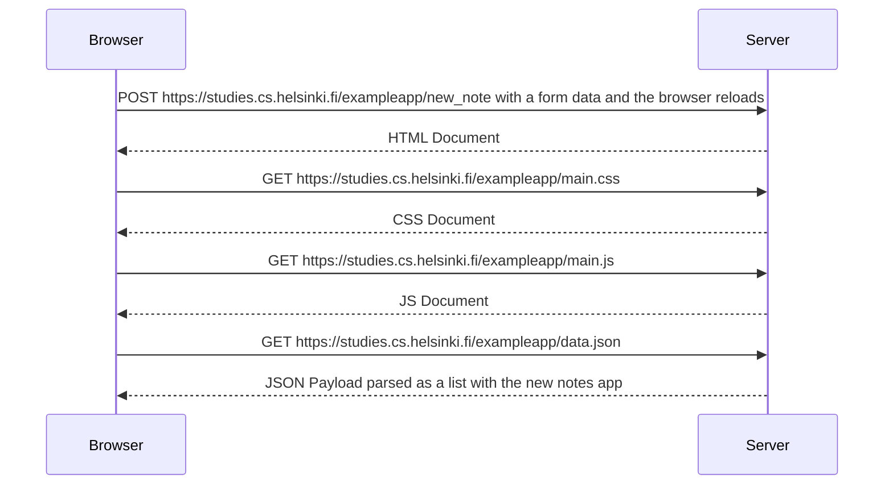

```mermaid

sequenceDiagram
    Browser->>Server: POST https://studies.cs.helsinki.fi/exampleapp/new_note with a form data and the browser reloads
    Server-->>Browser: HTML Document
    Browser->>Server: GET https://studies.cs.helsinki.fi/exampleapp/main.css
    Server-->>Browser: CSS Document
    Browser->>Server: GET https://studies.cs.helsinki.fi/exampleapp/main.js
    Server-->>Browser: JS Document
    Browser->>Server: GET https://studies.cs.helsinki.fi/exampleapp/data.json
    Server-->>Browser: JSON Payload parsed as a list with the new notes app

```