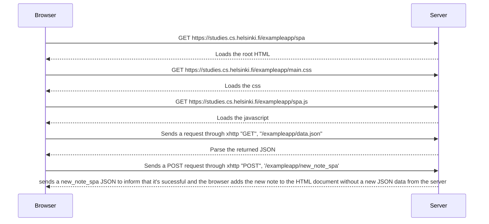

```mermaid

sequenceDiagram
    Browser->>Server: GET https://studies.cs.helsinki.fi/exampleapp/spa
    Server-->>Browser: Loads the root HTML
    Browser->>Server: GET https://studies.cs.helsinki.fi/exampleapp/main.css
    Server-->>Browser: Loads the css
    Browser->>Server: GET https://studies.cs.helsinki.fi/exampleapp/spa.js
    Server-->>Browser: Loads the javascript
    Browser->>Server: Sends a request through xhttp "GET", "/exampleapp/data.json"
    Server-->>Browser: Parse the returned JSON 
    Browser->>Server: Sends a POST request through xhttp "POST", '/exampleapp/new_note_spa'
    Server-->>Browser: sends a new_note_spa JSON to inform that it's sucessful and the browser adds the new note to the HTML document without a new JSON data from the server


```